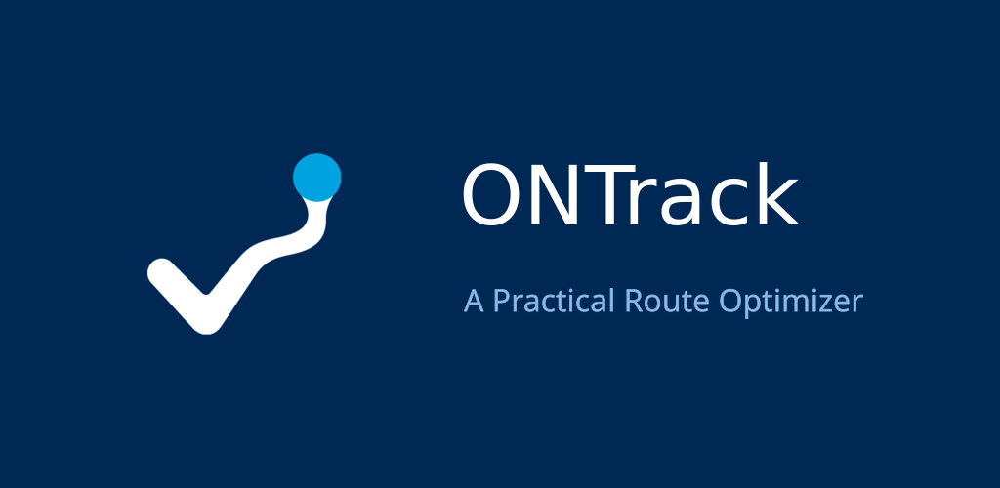
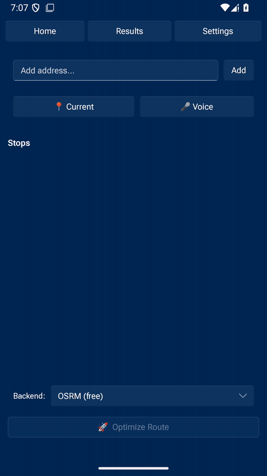

# ONTrack — Field Route Optimizer

<p align="center">
  
</p>

A practical route optimizer.
Import a list of stops, get back an efficient driving order, and open it in
your maps app of choice — no cloud backend, no Python runtime, no OR-Tools
dependency.

Ships as two native apps sharing one core library:

- **Desktop** — a three-panel [egui](https://github.com/emilk/egui) GUI for Linux, Windows, and macOS.
- **Android** — a `NativeActivity` app with a [Slint](https://slint.dev) UI, distributed via Google Play and F-Droid.

---

## Preview

The Android app, recorded from the current build: adding stops on Home, the Results page, and Settings.

<p align="center">
  
</p>

<p align="center">
  <a href="docs/media/ontrack-preview-v2.mp4">Watch the full video preview (MP4)</a>
</p>

---

<details>
<summary>Crates</summary>

| Crate | Type | Description |
|---|---|---|
| [`ontrack-core`](crates/ontrack-core) | library | Address parsing (CSV/XLSX), geocoding (Nominatim/Google), distance matrix (haversine/OSRM/Google), nearest-neighbor + 2-opt TSP solver, export URL builders, optional on-device Whisper voice input |
| [`ontrack-desktop`](crates/ontrack-desktop) | binary (`ontrack`) | egui desktop GUI — Linux, Windows, macOS |
| [`ontrack-mobile`](crates/ontrack-mobile) | cdylib + Android app | `NativeActivity` + Slint UI, built with `cargo-ndk` and packaged with Gradle |

</details>

---

<details>
<summary>Quick Start (desktop)</summary>

```bash
git clone https://github.com/qompassai/ontrack.git
cd ontrack

# Build and run the desktop GUI
cargo build --release -p ontrack-desktop
./target/release/ontrack

# Run the core library's tests
cargo test -p ontrack-core
```

</details>

---

<details>
<summary>Configuration</summary>

Copy `.env.example` to `.env` in the repo root:

```bash
cp .env.example .env
```

```env
GOOGLE_MAPS_API_KEY=""    # optional — enables Google geocoding/distance matrix + Street View
OSRM_BASE_URL="http://router.project-osrm.org"
ARCGIS_ITEM_ID=""         # optional — your ArcGIS Online web map ID, for FieldMaps deep links
ONTRACK_WHISPER_MODEL="base"
```

### Getting the keys

**GOOGLE_MAPS_API_KEY** — optional; only needed if you want Google for geocoding and driving distances instead of the free backends below.

1. In the [Google Cloud Console](https://console.cloud.google.com/), create or select a project.
2. Enable the **Geocoding API** and the **Distance Matrix API** for that project.
3. Go to **APIs & Services → Credentials → Create credentials → API key**.
4. Recommended: restrict the key to those two APIs, so it cannot be used for anything else.

Full walkthrough: Google’s [Get API key](https://developers.google.com/maps/documentation/geocoding/get-api-key) guide.

**ARCGIS_ITEM_ID** — not an API key. It is the ID of your own ArcGIS Online web map, used to build Field Maps deep links.

1. Sign in to [ArcGIS Online](https://www.arcgis.com/home) (a free account works) and create or open your web map.
2. Open the map’s item details page.
3. The item ID is the `id=` value in the page URL — copy it into `.env`.

See the ArcGIS Online [item details](https://doc.arcgis.com/en/arcgis-online/manage-data/configure-item-details.htm) documentation.

**Free backends — no key at all.** Nominatim geocoding and the public OSRM router (`OSRM_BASE_URL`) work without an account. If you send heavy traffic, respect the [Nominatim usage policy](https://operations.osmfoundation.org/policies/nominatim/) or [self-host OSRM](https://project-osrm.org/) instead.

**ONTRACK_WHISPER_MODEL** — picks the on-device Whisper model for voice input (for example `base`). No key and no account.

**No API key required.** Without one, the app uses:
- Nominatim (OpenStreetMap) for geocoding
- The public OSRM router for real driving distances, or offline haversine distance
- Plain Google Maps / Waze / Apple Maps URL schemes for turn-by-turn navigation

</details>

---

<details>
<summary>Solver</summary>

Nearest-neighbor seed + 2-opt local search — pure Rust, no C++ FFI, no OR-Tools.
For typical field routes (≤ 50 stops) this produces near-optimal results in
well under a second.

| Backend | Algorithm | Quality | Speed (50 stops) |
|---|---|---|---|
| 2-opt (default) | NN seed + 2-opt local search | Near-optimal | < 1s |
| Nearest-neighbor | Greedy NN | Good | < 10ms |

</details>

---

<details>
<summary>Android build (Play Store / F-Droid)</summary>

The Android app is built in two stages: `cargo-ndk` compiles the Rust core
into `libontrack_mobile.so` for `arm64-v8a` and `armeabi-v7a`, then Gradle
packages it into an APK/AAB. Nothing is committed as a prebuilt binary — both
stores build from source.

```bash
# One-shot build (AAB for Play Store, APK for sideloading/F-Droid, or both)
./scripts/build-android.sh both

# Local emulator smoke test (SDK setup, AVD, install, launch, screenshot)
./scripts/acli.sh full ontrack 4
```

See [`scripts/`](scripts) for the full Android/emulator/signing toolchain, and
[`fastlane/`](fastlane) + [`fdroiddata/`](fdroiddata) for the store metadata.

Application ID: `ai.qompass.ontrack`

</details>

---

<details>
<summary>Architecture</summary>

```
ontrack/
├── Cargo.toml                          # workspace
├── crates/
│   ├── ontrack-core/
│   │   └── src/
│   │       ├── lib.rs
│   │       ├── config.rs               # .env / environment loading
│   │       ├── parser.rs               # CSV / XLSX address files
│   │       ├── geocoder.rs             # Nominatim + Google geocoding
│   │       ├── matrix.rs               # haversine + OSRM + Google distance matrix
│   │       ├── solver.rs               # nearest-neighbor + 2-opt TSP
│   │       ├── exporter.rs             # CSV, Maps URL, FieldMaps, Street View, Waze
│   │       └── voice.rs                # optional on-device Whisper voice input
│   ├── ontrack-desktop/
│   │   └── src/
│   │       ├── main.rs
│   │       ├── app.rs                  # worker-thread app state
│   │       └── views/                  # home / results / settings panels
│   └── ontrack-mobile/
│       ├── src/
│       │   ├── lib.rs                  # android_main entry point
│       │   ├── controller.rs           # Slint UI wiring
│       │   ├── gps.rs                  # Android LocationManager via JNI
│       │   └── preview_main.rs         # desktop preview of the mobile UI
│       ├── ui/app.slint
│       └── android/                    # Gradle project (Play Store + F-Droid)
├── scripts/                            # build, sign, emulate, screenshot tooling
├── fastlane/                           # Play Store release automation
├── fdroiddata/                         # F-Droid metadata recipe
└── playstore/                          # Play Console listing metadata
```

</details>

---

## License

Apache License 2.0 — see [LICENSE.md](LICENSE.md).
